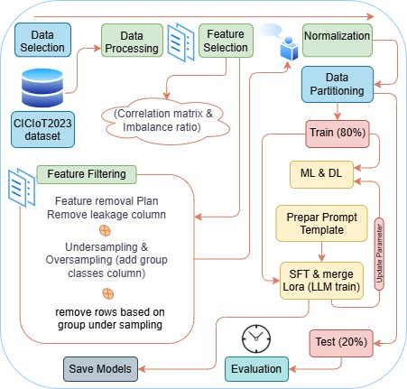

## Benchmarking AI models for IoT Network Intrusion Detection:An Analysis of Performance and Time Efficiency

COMP9340 – Computer Security Course - 2025

- Lecture: Prof. [Mohaiesn Daivad](https://www.cs.ucf.edu/~mohaisen/)
- Students: [Ruwa AbuHweidi](https://github.com/RuwaYafa) and [Monther Salahat](https://github.com/msalahat2015/IoT-IDS)

---
* Our Project has two evaluation parts: Deep Learning and Machine Learning code are available on this repository [Monther Salahat](https://github.com/msalahat2015/IoT-IDS), and LLM code [Ruwa AbuHweidi](https://github.com/RuwaYafa/IoT-IDS-LLM)
* All Results are uploaded in repository [Dropbox](https://www.dropbox.com/scl/fo/7y8a8j7tko3da90sr6mco/AHpHYC95o7b65hER_MAKjKs?rlkey=2m6asv519j7w6li4d2c45ecbo&dl=0):
  * [Logs](https://www.dropbox.com/scl/fo/62zortvc8kuwud8ptn1n0/AEUulu3p5iGV0338tpijExU?rlkey=oaj70ynnmv2dtruwp5j4obs9v&dl=0).
  * [Saved models (Machine and Deep Learning)](https://drive.google.com/drive/folders/14io4lIMozrjQo1An5drDHKUwH6-ukY3X?usp=sharing).
  * [Checkpoints](https://www.dropbox.com/scl/fo/yg306y5df9y5eyjp9mz72/AKbDfF1MVBljfVSORMXKsC4?rlkey=wgv7mnhscnbvij32v12qd8lgo&dl=0) for trained LLM models.
---
## Project Structure 
<pre><code>
├── src/
│   ├── algorithms/
│   │   ├── _pycache_/
│   │   ├── base/
│   │   │   ├── _pycache_/
│   │   │   ├── _init_.py
│   │   │   └── base_algorithm.py
│   │   ├── custom_learning/
│   │   │   ├── _pycache_/
│   │   │   ├── stacking.py
│   │   │   └── voting.py
│   │   ├── deep_learning/
│   │   │   ├── _pycache_/
│   │   │   ├── DL-BiLstm.py
│   │   │   ├── _init_.py
│   │   │   ├── ann.py
│   │   │   ├── bilstm.py
│   │   │   ├── cnn.py
│   │   │   ├── dnn.py
│   │   │   ├── lstm.py
│   │   │   └── rnn.py
│   │   ├── machine_learning/
│   │   │   ├── _pycache_/
│   │   │   ├── _init_.py
│   │   │   ├── adaboost.py
│   │   │   ├── autoencoder.py
│   │   │   ├── balanced_svm.py
│   │   │   ├── decision_tree.py
│   │   │   ├── extra_trees_classifier.py
│   │   │   ├── gradient_boosting.py
│   │   │   ├── isolation_forest.py
│   │   │   ├── knn.py
│   │   │   ├── lightgbm.py
│   │   │   ├── localoutlierclass_lof.py
│   │   │   ├── logistic_regression.py
│   │   │   ├── mlp.py
│   │   │   ├── naive_bayes.py
│   │   │   ├── pca.py
│   │   │   ├── perceptron.py
│   │   │   ├── random_forest.py
│   │   │   ├── svm.py
│   │   │   ├── threshold.py
│   │   │   ├── weighted_svm.py
│   │   │   └── xgboost.py
│   │   └── reinforcement_learning/
│   │       ├── _pycache_/
│   │       ├── _init_.py
│   │       └── dqn.py
│   ├── utils/
│   │   └── _init_.py
│   ├── datasets/
│   │   ├── _pycache_/
│   │   ├── custom/
│   │   │   ├── _pycache_/
│   │   │   ├── cic_preprocessing.py
│   │   │   ├── _init_.py
│   │   │   ├── data_loader.py
│   │   │   └── preprocessing.py
│   │   └── evaluation/
│   │       ├── _pycache_/
│   │       ├── _init_.py
│   │       ├── metrics.py
│   │       └── visualization.py
│   ├── _init_.py
│   └── main.py
├── algorithms.json  # If this is a config file related to algorithms, it stays.
└── README.md
</code></pre>

This project, "Evaluating Artificial Intelligent models for IoT Network Intrusion Detection: An Analysis of Performance and Time Efficiency," aims to develop, implement, and rigorously evaluate various Artificial Intelligence (AI) models for detecting intrusions within Internet of Things (IoT) networks. Given the increasing proliferation of IoT devices and their inherent security vulnerabilities, an effective and efficient Intrusion Detection System (IDS) is paramount. This project specifically focuses on analyzing both the performance (accuracy, precision, recall, F1-score) and time efficiency (training time, detection latency, resource consumption) of different AI models when applied to real-world IoT network traffic.

Project Goals:

Implement a diverse set of AI models: This includes traditional Machine Learning (ML) algorithms (e.g., Random Forest, Logistic Regression), Deep Learning (DL) architectures (e.g., ANN, CNN, LSTM), and specialized Anomaly Detection (AD) techniques (e.g., Isolation Forest).
Develop robust data handling and preprocessing pipelines: To manage the unique characteristics of IoT network data, including high volume, velocity, and potential imbalances.
Establish a comprehensive evaluation framework: To systematically compare the effectiveness and efficiency of implemented AI models under various attack scenarios and normal IoT traffic conditions.
Analyze the trade-offs between performance and time efficiency: Identifying models that offer an optimal balance for resource-constrained IoT environments.
Contribute to the understanding of AI-driven IDS in IoT: Providing insights into the practical challenges and opportunities of deploying intelligent security solutions in this critical domain.
Expected Outcomes:

The project is expected to yield insights into which AI models are most suitable for real-time IoT network intrusion detection, considering both their ability to accurately identify diverse threats and their computational demands on often resource-limited IoT devices. This research will contribute valuable knowledge for developing more resilient and secure IoT ecosystems.

